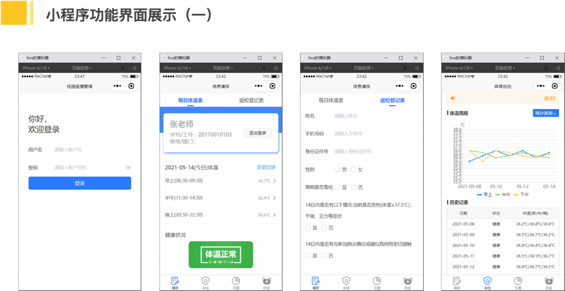
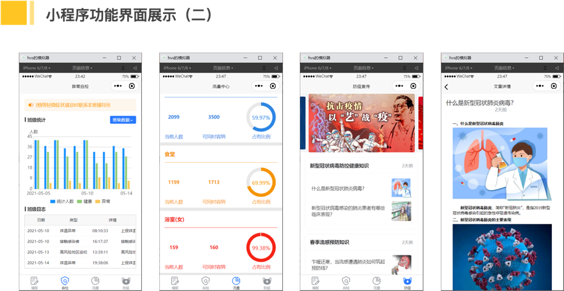
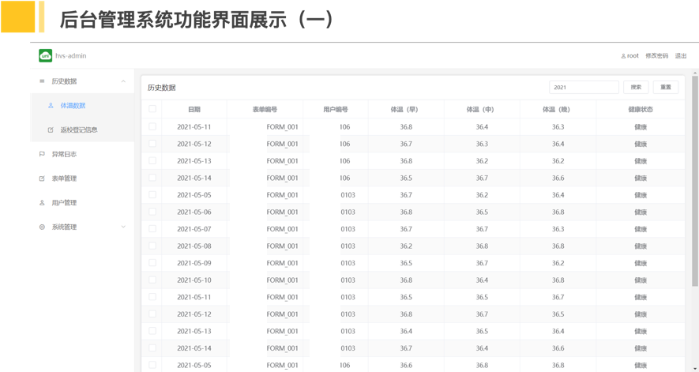
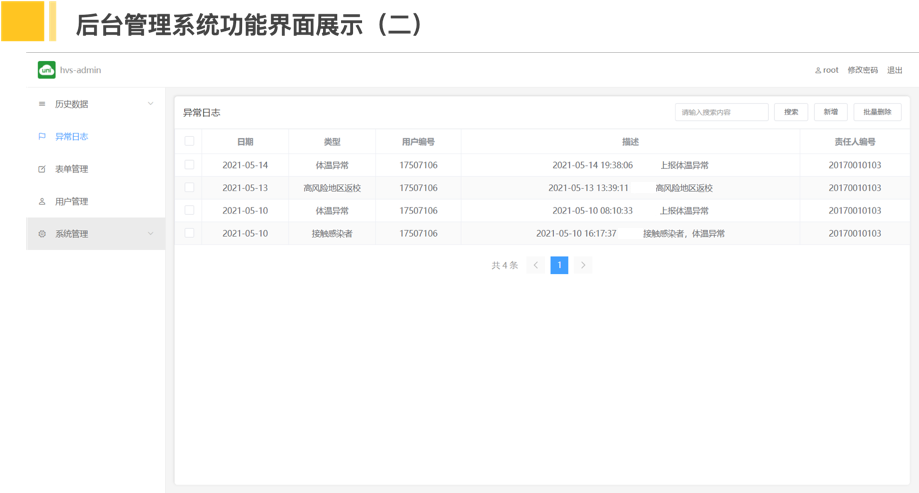
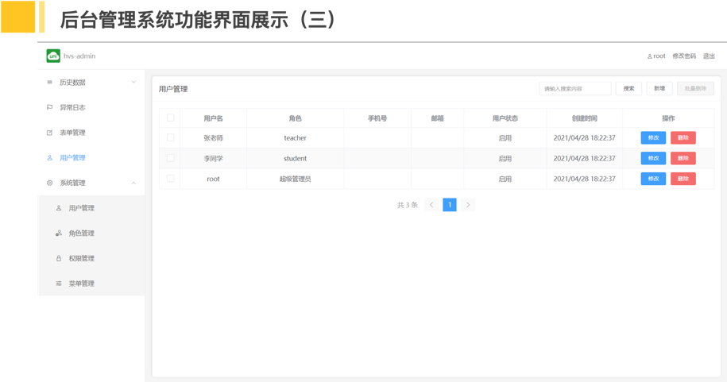

# 校园疫情监控管理小程序

一个基于uni-app和uniCloud的全栈项目，仅供参考个人学习参考。

---

# 一、功能展示
核心功能包括：用户信息管理、信息填报、实时统计、健康查询、异常通知等。

- 小程序功能展示

- 管理后台功能展示

---

# 二、项目运行

- 安装[HBuilderX](https://www.dcloud.io/hbuilderx.html)
- 导入hvs和hvs-admin，安装项目依赖
- 创建云开发空间，初始化数据库，上传云函数
- 顶部菜单 -> 运行
